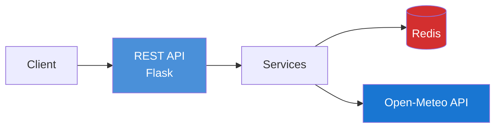

# Weather Proxy Service - Architecture Diagrams

## Diagrams

| Diagram | Description |
|---------|-------------|
| [component_diagram.mmd](component_diagram.mmd) | Internal packages and their relationships |
| [system_design_diagram.mmd](system_design_diagram.mmd) | High-level architecture with external systems |
| [flow_diagram.mmd](flow_diagram.mmd) | Request flow sequence diagram |
| [error_flow_diagram.mmd](error_flow_diagram.mmd) | Error handling flowchart |
| [circuit_breaker_diagram.mmd](circuit_breaker_diagram.mmd) | Circuit breaker state machine |
| [class_diagram.mmd](class_diagram.mmd) | Classes and relationships |

## Quick Architecture Overview

## Viewing

- **VS Code**: Install "Markdown Preview Mermaid Support" extension
- **GitHub**: Renders automatically
- **Online**: [Mermaid Live Editor](https://mermaid.live/)
